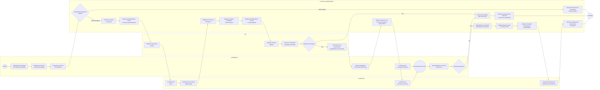

```mermaid
graph LR

%% =========================
%% KIEROWNIK
%% =========================
subgraph KIEROWNIK

Start((START)) --> K1["Zdefiniowanie wymagań<br/>dla nowego stanowiska"]

K1 --> K2["Wypełnienie wniosku<br/>o utworzenie wakatu"]

K2 --> K3["Przekazanie wniosku<br/>do akceptacji"]

K5["Wybór kandydatów<br/>do rozmowy technicznej"]

K_JOIN["Dołączenie do<br/>rozmowy technicznej"]

K_JOIN --> INT1

INT1 --> K6["Przeprowadzenie rozmowy<br/>technicznej"]

K6 --> K7{"Decyzja pozytywna?"}

end


%% =========================
%% SYSTEM WEWNĘTRZNY
%% =========================
subgraph SYSTEM_WEWNETRZNY

K3 --> S1{"Weryfikacja dostępności<br/>budżetu"}

S1 -- Brak środków --> S2["Wysłanie informacji do Kierownika<br/>o braku budżetu"]

S1 -- Budżet dostępny --> S3["Utworzenie wakatu<br/>w systemie"]

S3 --> S4["Wysłanie powiadomienia do HR<br/>o nowym zapotrzebowaniu"]


S5 --> S6_DB["Zapisanie aplikacji kandydata<br/>w bazie danych"]

S6_DB --> S7["Wysłanie powiadomienia do HR<br/>o nowej aplikacji"]


K5 --> S8["Wysłanie zaproszeń na rozmowę techniczną<br/>(email, SMS)"]


H5 --> X9["Wysłanie automatycznej informacji<br/>o odrzuceniu kandydata"]

H6 --> S9["Wygenerowanie umowy<br/>w formacie PDF"]

S9 --> S10["Wysłanie kompletu dokumentów<br/>do kandydata"]

S11["Zapisanie podpisanych dokumentów<br/>w systemie"]

end


%% =========================
%% HR
%% =========================
subgraph HR

S4 --> H1["Publikacja ogłoszenia<br/>o pracę"]

S7 --> H3["Wstępna selekcja<br/>aplikacji"]

H3 --> X3["Analiza CV pod kątem<br/>wymagań stanowiska"]

X3 --> H4_DEC{"Spełnienie wymagań?"}

H4_DEC -- Nie --> H5["Oznaczenie aplikacji<br/>jako odrzuconej"]

H4_DEC -- Tak --> R4["Przekazanie listy potencjalnych<br/>kandydatów do Kierownika"]

K7 -- Nie --> H5

K7 -- Tak --> H6["Wprowadzenie warunków<br/>zatrudnienia do systemu"]

end


%% =========================
%% KANDYDAT
%% =========================
subgraph KANDYDAT

H1 --> K_VIEW["Przegląd ofert<br/>pracy"]

K_VIEW --> K_FILL["Wypełnienie formularza<br/>aplikacyjnego"]

K_FILL --> S5["Walidacja techniczna<br/>formularza"]


S8 --> C2["Dołączenie do<br/>rozmowy technicznej"]

C2 --> INT1


S10 --> C3["Odesłanie podpisanych<br/>dokumentów zatrudnienia"]

end


%% =========================
%% POŁĄCZENIA MIĘDZY TORAMI
%% =========================
R4 --> K5

C3 --> S11


%% =========================
%% EVENT WSPÓLNY
%% =========================
INT1((Rozmowa techniczna))


%% =========================
%% ZAKOŃCZENIA
%% =========================
S2 --> End((KONIEC))
X9 --> End
S11 --> End
```