```mermaid
graph LR

%% ======================
%% PRACOWNIK
%% ======================
subgraph PRACOWNIK
    Start((START)) --> PrzegladSzkolen["Przegląd dostępnych<br/>szkoleń"]
    PrzegladSzkolen --> WyborSzkolenia["Wybór szkolenia<br/>z listy"]
end



%% ======================
%% SYSTEM WEWNĘTRZNY
%% ======================
subgraph SYSTEM_WEWNETRZNY
    WyborSzkolenia --> CzySaMiejsca{"Czy są wolne<br/>miejsca?"}

    %% Brak miejsc
    CzySaMiejsca -- Nie --> ListaRezerwowa["Dopisanie do<br/>listy rezerwowej"]
    ListaRezerwowa --> PowiadomienieOczekiwanie["Powiadomienie pracownika<br/>o statusie oczekiwania"]

    %% Są miejsca
    CzySaMiejsca -- Tak --> WeryfikacjaBudzetu{"Weryfikacja dostępności<br/>budżetu działu"}

    %% Brak budżetu
    WeryfikacjaBudzetu -- Brak --> OdrzucenieBudzet["Odrzucenie wniosku<br/>z powodu braku budżetu"]
    OdrzucenieBudzet --> PowiadomienieOdrzucenie["Powiadomienie pracownika<br/>o odrzuceniu"]

    %% Budżet dostępny
    WeryfikacjaBudzetu -- Jest --> WniosekDoKierownika["Przekazanie wniosku<br/>do kierownika"]

    %% Po akceptacji przełożonego
    DecyzjaKierownikaAkceptacja --> Rejestracja["Rejestracja na liście<br/>uczestników"]
    Rejestracja --> WyslanieBiletu["Wysłanie biletu wstępu<br/>lub linku do szkolenia"]

    %% Po szkoleniu
    WypelnienieAnkiety --> AnkietaWypelniona{"Czy ankieta została<br/>wypełniona?"}
    AnkietaWypelniona -- Nie --> WypelnienieAnkiety
    AnkietaWypelniona -- Tak --> GenerowanieCertyfikatu["Generowanie certyfikatu<br/>ukończenia szkolenia (PDF)"]
    GenerowanieCertyfikatu --> AktualizacjaProfilu["Aktualizacja profilu<br/>kompetencji pracownika"]
end


%% ======================
%% KIEROWNIK
%% ======================
subgraph KIEROWNIK
    WniosekDoKierownika --> AnalizaWniosku["Analiza wniosku<br/>szkoleniowego"]
    AnalizaWniosku --> DecyzjaKierownika{"Decyzja przełożonego"}
    DecyzjaKierownika -- Odrzucenie --> PowodOdrzucenia["Wprowadzenie powodu<br/>odrzucenia wniosku"]
    PowodOdrzucenia --> PowiadomienieOdrzucenie
    DecyzjaKierownika -- Akceptacja --> DecyzjaKierownikaAkceptacja["Akceptacja wniosku na szkolenie"]
end


%% ======================
%% HR
%% ======================
subgraph HR
    PowiadomienieOczekiwanie --> MonitoringRezerwowej["Obserwacja listy<br/>rezerwowej"]
    MonitoringRezerwowej --> ZwolniloMiejsce{"Czy zwolniło się<br/>miejsce?"}
    ZwolniloMiejsce -- Tak --> OdblokowanieMiejsca["Odblokowanie miejsca<br/>w szkoleniu"]
    OdblokowanieMiejsca --> WeryfikacjaBudzetu
    ZwolniloMiejsce -- Nie --> ZamkniecieRekrutacji["Zamknięcie rekrutacji<br/>na szkolenie"]
end


%% ======================
%% KONIEC PROCESU
%% ======================
PowiadomienieOdrzucenie --> End((KONIEC))
AktualizacjaProfilu --> End
ZamkniecieRekrutacji --> End
```

https://mermaid.live/edit#pako:eNqdVltvGkcU_iujlSJhyXEIhmKjNpWNaes6NgioUNytqmF3jMe7zKxmd0VZyy9W8h9i9WfkNW-B_9UzZ_bGxSQpT8y5n-_c9t5ypMusljVRNLglb_u2sMWLF-SnrT9k9fon7e7o6vxip2AYj43JkjiB3yCiKqpUBsOT_nBvj7x8-Yb0VMImPnUHiSd9Jv60LUNZfHCJK8No8RSIuXP741i9ehOizPK9bf1l7K0po8HRfCxVSuAU7AHhyydFwoyEphLi8zCaoyUmXJ3415MfvBsMO5dk1BldLT4O-9dX774NBaP3t9brpGo6-tVIMfh2Mh_QS87uQofe2xY8Sbj4QGbSFwzjnhrez7b1oOPVZiCCU0U9YliGVrYDhskVZ2j_LSRN-yxhaiZnGpwzGfCQCmC7Eh0gLESlIuwux3pV1dROzjh1JTgGA10nYR6faVu6iGUWCRR15Exwz4AvCZiK4hA4Mtei6ClPaQBpp8luT2kIKWO9mZrfgGXnjp7GbsKiGIArEfMukst_HY7-x7G7_AyCxE04XT7GW8DMRNJKbfjQEaCgDqHrqiR2dKaGC_kXJAJ5y9CL07YL5Ey6MRmDblx4yUBet7QF5lzi6yjLTDZexfbUuC3ma1eWv7PQhDHSeTDvTF5wpoyfdFo9mtD1TF1JvFxu1X1PEuo5LIjAE4eoE7Z8lMvPUrCJNEJnzJknd7RwdJLJm8brszuISuk3hFB6EUFhsHWhzbjE0F5hBBa-fJrlIJflzcYIfR3_KfchZ9wY4fIRMxojicwQJ5OYH4_BhYDqQYr5UtnIMONkHTQPmC-wTicCgIEZ067Nf5pypciGnho6SaBC0KGmoDOQWj6imJl_bXjDQnncN73uUMoG6lcmNOw6_zZTEbYEwlJiEKfgGKA9uXwPYOtFloNCKr2zX_Zy3LcbNjh4UUx9nuia9JS84b52WKZCnyAZvXlyGrCICdM_WdevLvPdq_zivNP_jjtWEsdqbo5CWk4Md2TmQGdgCCuTkcED2xX6PQNnVRWtbUwBNEdKW5-arBs2VHRhS7soXSfSzWl4IQNdFjcxWwQXlNkguVCWQHF5V43s2lM7Ilsb6x1jj92QC6fR6GnP0GTfU_3f-t9Wdi2XZrv10GHUl1LwSCouJv38auoLMA7hgeHiTUVEt9zVbepo91pffe5Lc_NYuhkSpELpScgXT6VvAlbshDXN8nB33bEvPTOE6THFa1VQs6trVk5pjxU3asPEM4f42Wiy_XRNpx5YgW3dZ56K8SBAOIa8eAI6fIlkDAzo_1b8ont13mnD92i33Rn8sVP6mTbGgDvCrVSMrb09W2xZW5mYLbYlV3Ctffjq5q7VilTM9q0pU1Oqn9a9Rs22ols2hQxb8NelyrMtWzyATkDFtZTTTE3JeHJrtW6oH8IrDlwasTNOoXsLEUCIqbaMRWS1Xtdrxz-gFat1b_1jtQ5rB436UfO4Wa_VGvVqtbZvzUGs2Tw4qlebjUazevi6Bs-HfStBv9WD40at0Tg8rjWPjrXMw38vLD4M