```mermaid
graph LR
    %% =========================
    %% SYSTEM WEWNĘTRZNY
    %% =========================
    subgraph SYSTEM_WEWNETRZNY["SYSTEM WEWNĘTRZNY"]
        Start((START)) --> S1["Utworzenie cyklu<br/>ocen okresowych"]
        S1 --> S2["Ustawienie statusu:<br/>Nowy cykl"]
        S2 --> S3["Wygenerowanie<br/>formularzy ocen"]
        S3 --> S4["Wysłanie powiadomień<br/>email"]
        S4 --> S5["Ustawienie statusu:<br/>Oczekiwanie na samoocenę"]

        %% Walidacja
        P3 --> S6{"Czy formularz<br/>kompletny?"}
        S6 -- Nie --> S7["Wyświetlenie komunikatu<br/>o brakującyh danych"]
        S7 --> P2
        S6 -- Tak --> S8["Ustawienie statusu:<br/>Oczekuje na zatwierdzenie"]

        %% Po ocenie kierownika
        M3 --> S9["Zablokowanie edycji<br/>formularzy"]
        S9 --> S10["Wysłanie zaproszenia<br/>na spotkanie"]

        %% Finalizacja
        M5 --> S11["Obliczenie wyniku<br/>końcowego"]
        S11 --> S12["Ustawienie statusu:<br/>Zakończona"]
        S12 --> S13["Archiwizacja dokumentów<br/>w raportach pracownika"]
    end

    %% =========================
    %% PRACOWNIK
    %% =========================
    subgraph PRACOWNIK["PRACOWNIK"]
        S4 --> P1["Otwarcie formularza<br/>w portalu"]
        P1 --> P2["Wypełnienie<br/>samooceny"]
        P2 --> P3["Wysłanie<br/>formularza"]

        S10 --> P4["Spotkanie: Rozmowa odnośnie uzyskanej oceny"]
        P4 --> P5{"Czy pracownik zgłasza<br/>zastrzeżenia?"}
    end

    %% =========================
    %% KIEROWNIK
    %% =========================
    subgraph KIEROWNIK["KIEROWNIK"]
        S8 --> M1["Analiza samooceny<br/>pracownika"]
        M1 --> M2["Wypełnienie oceny<br/>przełożonego"]
        M2 --> M3["Zatwierdzenie oceny<br/>do rozmowy"]
        M4["Udział w spotkaniu<br/>oceniającym"]

        M4 --> P4

        P5 -- Nie --> M5["Zatwierdzenie oceny<br/>końcowej"]
        P5 -- Tak --> M6["Przekazanie sprawy<br/>do HR"]
    end

    %% =========================
    %% HR
    %% =========================
    subgraph HR["HR"]
        M6 --> H1["Mediacja między<br/>stronami"]
        H1 --> H2{"Decyzja HR"}
        H2 -- Podtrzymanie --> M5
        H2 -- Korekta --> H3["Ręczna korekta<br/>oceny"]
        H3 --> S11
    end

    %% =========================
    %% KONIEC
    %% =========================
    S13 --> End((KONIEC))
```

https://mermaid.live/edit#pako:eNqdVl1v4kYU_SujkVZKpGyKDeZL7VZRloooa4IMK7QpVTXYs2CMPWhsy7WjvETb_9Bof0Zf963wv3pnxhjspWkSP9l4zr3n3nPuNXfYZg7FXTznZL1AH6xpgOB68wb99F9XcWL0aTTumWjSmww2f42t28Gn54LDeKbyqRC_ixA9GeHXKT4SFv-mcOIaRYRHJyej8YU1Pj1Fb9--QyMNYB-jhPGMBi5Fduqt4h9n_Id3zKYBYh6nIUtSe1EOpCmwLsBhRBJXguEuisO4K_EDgMlwZaSukHVATtI5DShnCQGwxHxm3I9XhGcpEunLyLpCNiQy3D4IFFqzxCUO8126_SJDUJ-4lZQNBTSeIHtjZ9RzJREUEBQSnwkCm0cZaR8L9JmQlesQe0n2vw5zas27Kb4E7kUZMrbH_PWKRkH68xTfH9BqAggNIKHEtmRZ26_ALlpJgoCLA9cDlkoPNOPEi5ebP-10gRwSfCdKS0Ya6tUcY-KpHO3_60C8lOVnJIIj3JGW-L4DQybVERRdIZ8guT9g5s3oQLJbMlsxTwmMqJPaS7eic7mCTu7JWknjjKw5CwUZItFCoDWLPHKU3S9uAAplZYVMI48s7H4zW7m2snuSAvk4l2n7xWYJnbOK1XOva0-Z_ZZIeMYCUkHnfteE4S-4vXATxQ05zIt9GkT__J3IEAmCsWY8IvYCrTmx877uotHA2RX6rA0ztC4ubyaDq-sXL5YCCYz3UY5M1FA2M0oIt6EfhaYkL0cWs4pLyKGWe1QKvKbbh0B2U0J2U1c2xVB1cFg_9ETZRaTiAjCQwohdMdpZpYsslvlgRsScgG2_ChHjLA3hJV2iI4nzKo18qgtRUDYHFmFeaEbCCJbn9pvw537EX6rX9VXPep1eBRKK3Ucp6dWWlZhCrws1HcWKS2URRwwnx0bJZVblQodIqP2Bbb-xoDo6plLOrMtNcLBSDuAOQ1yqUu69KZT76GQu2T6gpBj3_ZfJJXIR-hXlzVyzxuGPQ-Nw05rGE3R2S2BZdoJxuEbNphgMKNsjmdxPIXQvKcrpW6-e2b71YvH7FpA5SCmb0JQ8-0JukzquXDe-u3l0MsUSDAuLyndLqL7Suq-D3d9TO80AJAIffLL6QlBY_w4YPvVl7aqj1SPXjFMvIiqgkN_aPNoZ7G1PvShkLKver--29Ctn6GZw1bt8LgB2skzXC5yTEwU9PZ0G-Az-0LkO7kY8pmfYpxz-UcAjvhOwKY4W1IfPThduHcK9KZ4G94BZk-CWMX8H4yyeL3D3M1mF8BSvHRLR9y4B0fZHoDzKL1kcRLjbauttGQR37_AfuGs0z-stXW8ZtVa9oTf1hnGGU9zVDe3caNc7NXjX0Jqadn-GM5m2dt5pNDS9o-nNVktr1Nra_b9Tcivw