```mermaid
graph LR

%% =========================
%% KIEROWNIK
%% =========================
subgraph KIEROWNIK

Start((START)) --> K1["Zdefiniowanie wymagań<br/>dla nowego stanowiska"]

K1 --> K2["Wypełnienie wniosku<br/>o utworzenie wakatu"]

K2 --> K3["Przekazanie wniosku<br/>do akceptacji"]

K5["Wybór kandydatów<br/>do rozmowy technicznej"]

K_JOIN["Dołączenie do<br/>rozmowy technicznej"]

K_JOIN --> INT1

INT1 --> K6["Przeprowadzenie rozmowy<br/>technicznej"]

K6 --> K7{"Decyzja pozytywna?"}

end


%% =========================
%% SYSTEM WEWNĘTRZNY
%% =========================
subgraph SYSTEM_WEWNETRZNY

K3 --> S1{"Weryfikacja dostępności<br/>budżetu"}

S1 -- Brak środków --> S2["Wysłanie informacji do Kierownika<br/>o braku budżetu"]

S1 -- Budżet dostępny --> S3["Utworzenie wakatu<br/>w systemie"]

S3 --> S4["Wysłanie powiadomienia do HR<br/>o nowym zapotrzebowaniu"]


S5 --> S6_DB["Zapisanie aplikacji kandydata<br/>w bazie danych"]

S6_DB --> S7["Wysłanie powiadomienia do HR<br/>o nowej aplikacji"]


K5 --> S8["Wysłanie zaproszeń na rozmowę techniczną<br/>(email, SMS)"]


H5 --> X9["Wysłanie automatycznej informacji<br/>o odrzuceniu kandydata"]

H6 --> S9["Wygenerowanie umowy<br/>w formacie PDF"]

S9 --> S10["Wysłanie kompletu dokumentów<br/>do kandydata"]

S11["Zapisanie podpisanych dokumentów<br/>w systemie"]

end


%% =========================
%% HR
%% =========================
subgraph HR

S4 --> H1["Publikacja ogłoszenia<br/>o pracę"]

S7 --> H3["Wstępna selekcja<br/>aplikacji"]

H3 --> X3["Analiza CV pod kątem<br/>wymagań stanowiska"]

X3 --> H4_DEC{"Spełnienie wymagań?"}

H4_DEC -- Nie --> H5["Oznaczenie aplikacji<br/>jako odrzuconej"]

H4_DEC -- Tak --> R4["Przekazanie listy potencjalnych<br/>kandydatów do Kierownika"]

K7 -- Nie --> H5

K7 -- Tak --> H6["Wprowadzenie warunków<br/>zatrudnienia do systemu"]

end


%% =========================
%% KANDYDAT
%% =========================
subgraph KANDYDAT

H1 --> K_VIEW["Przegląd ofert<br/>pracy"]

K_VIEW --> K_FILL["Wypełnienie formularza<br/>aplikacyjnego"]

K_FILL --> S5["Walidacja techniczna<br/>formularza"]


S8 --> C2["Dołączenie do<br/>rozmowy technicznej"]

C2 --> INT1


S10 --> C3["Odesłanie podpisanych<br/>dokumentów zatrudnienia"]

end


%% =========================
%% POŁĄCZENIA MIĘDZY TORAMI
%% =========================
R4 --> K5

C3 --> S11


%% =========================
%% EVENT WSPÓLNY
%% =========================
INT1((Rozmowa techniczna))


%% =========================
%% ZAKOŃCZENIA
%% =========================
S2 --> End((KONIEC))
X9 --> End
S11 --> End
```

https://mermaid.live/edit#pako:eNqVVttuIkcQ_ZXWSCthyXa4mZuSjVhgBYsNFkOMTVhZDdPGw8x0j-YiMmP5IY79BXlZaz9jX_Nm-K9Ud88FcCJjXphLn9Onq05VzZ0yYxpRasrcwfYtOh1M6IR--IB--b-feNvttAb9Ua_TfWut608l8QZiQlUPO14mow7rg-HBATo6-oi6ud8nylgjNzrV2RJTnaBlYOE5Xj_-PHV--qiZGFG2JHOGXA_Dle4aeKJ85XTdnKTIA8UosMn6AeCCAbhcwxcEDPnekjmhfIEN7PkxPC_hBYCfwwIDh3gXrTGEjRmxPTxb6DHuROw3ffnhIANTLdCw9_JjGa93WGixZYA8Mrul-iykZBEDr7_0Oz0AN9n6YfU0k5o0JpBvwYTWTm-Y44_4vxRfisTbDkRPk4wRlaD9D7qSRJbvQAiZBeECI5uFgRcsKf51otzzRYRq_G8PS6hX6rB1hkatUW_1bTgY96729oaEXnNoK0KCvIKQp-ZA3og4wY1uQOwxhMn1Vs82ZevvM10cbepr638IT6eQrPKIoE8ONtD6u8M0A3IiqaQ_3PWDSK9Ob5hj8XwCJ-rqBCJHYZPILVMg8FHK_XWDWz5MpASSnvvnt12PCbYlcgPXI5ZOYp7ocMUtRTa4GmvM4ublB0XtQSQG_B5YKMQ284B9Kgok1gRsJ5KtdN38xKsI27orCLFtiqjpiT9xpGeKQ245TIPZbayJwyVReX9ZZJHukgjqRoIqWzwg32FuSNaPiOLInKvn1OirJ0GbIRbWzUOknqkHCWNbMl5Wtxix7zELe4Gw9UZCI3lMc0J_Bqr99PwRY1uaX5V8c0J59gWnn5TMEkk-eHje_BxHqRrZMrulxGCWbYJPIDyGbxG62Qh291Zzua0s2UwTl5CKV_BXztm_INuDvQuwLbq-WhRHa3N15_7UjAqOzdcPPG2Q_CiutoNnq-f4NGWJ4u4fyXrAyCUmMQAsALv-aEvzX3JEnWJTDzFqXPAwIGP1BIeVJ4-6_-t2fynx7eJ1s9WA7qBudvwIFfcvuYgXbQ_eChjv2v2Q4qjtJurErgtsxL5haatMWYbQVTjLoLgzLEzd9QI4g0conNvkyRSEG4Nhu83EXbi8LS59Fm_V5q19tNnXl9jxqRFbJMSe42s0qU5pGP_dfunWe82rZn24_0hPABChaAxdX3Raoyg0c3P1pCF2QxxPCOW2CZJZxhdGmM-d09Pd0c1LzzexE255KFhQ-AJIODhQlqMYxWAlTVg2aSkSnHKlLbMicI38u6dwI781gXk5ZyUX93NfI2nbTMo66gRJaaPNnL07Uef99Z-rx8a41evU0Vln9a05vkLD_qB-1nkLPZAl3hU2a8QTNrfnxq2LVm-IRur5y9-nb493HqFMZiACuZmSg4M9txvXu_31X_Kcby1XZVZaVMtkuv1ep9Xg21xW46ei66Y3yiF87-qaUoM0kEPFItDn-a1yN6EITRTvlljQcWtwqWHHmCgTeg8YG9MxY1YMc5g_v1VqN9h04c63ocxJU8dQHekSSCtxGsynnlIrZnPFvGBRanfKH0rt6KRUOq6U8_lsoVrNlsuFyqESKLVq6bicL58UCsVqIVspVU7uD5VQ7Js7ruThVbZQqZSyhXwuW7z_F1FL6do